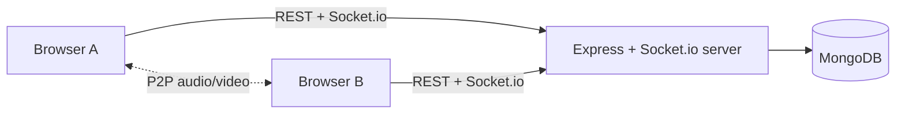

# JoinUs

A Zoom-style video meeting web app with custom WebRTC signaling. Create a meeting, share a link, admit guests from a waiting room and talk face to face in your browser.

Built without third-party media SDKs: peer connections use raw WebRTC and signaling runs on a hand-written Socket.io protocol.

## Problem Statement

Small teams, classes and study groups need a simple way to meet online without heavyweight platforms. JoinUs provides link-based meetings with host-controlled admission and reliable audio/video, even behind strict NATs.

## Target Users

- **Hosts:** teachers, team leads and organizers who schedule meetings and control who joins.
- **Participants:** anyone joining from a link on a desktop or mobile browser.

## Solution

A Node/Express + Socket.io server owns the business rules and relays signaling messages. A thin React client renders the state. Audio and video flow peer-to-peer (mesh, up to 6 participants) with STUN/TURN for NAT traversal.

## Key Features

- Register and log in with JWT authentication
- Instant and scheduled meetings with shareable codes (e.g. `abc-defg-hij`)
- Waiting room with host admit/deny controls
- Multi-party audio and video with mute, camera toggle and screen share
- In-meeting chat and meeting history
- Automatic reconnects, device switching and a connection-quality indicator
- Responsive, touch-friendly UI

## Tech Stack

| Layer | Technology |
| --- | --- |
| Client | React, Vite, React Router |
| Server | Node.js, Express, Socket.io |
| Database | MongoDB, Mongoose |
| Realtime media | WebRTC (P2P mesh), STUN + TURN |
| Auth and validation | JWT, bcrypt, zod |
| Testing | Jest, Supertest |
| Hosting | Vercel, Render, MongoDB Atlas |

## Architecture



```
joinus/
├── client/   # React + Vite web client
├── server/   # Express + Socket.io backend
└── README.md
```

## Local Setup

Requires Node.js 20+ and MongoDB (local or Atlas).

```bash
git clone <your-repo-url> joinus
cd joinus

# Server
cd server
cp .env.example .env
npm install
npm run dev

# Client (new terminal)
cd client
cp .env.example .env
npm install
npm run dev
```

The client runs at `http://localhost:5173` and the API at `http://localhost:5000`.

## Environment Variables

**`server/.env`**

| Variable | Description |
| --- | --- |
| `NODE_ENV` | Runtime mode |
| `PORT` | API port |
| `MONGODB_URI` | MongoDB connection string |
| `JWT_SECRET` | Secret for signing JWTs |
| `JWT_EXPIRES_IN` | Token lifetime (e.g. `7d`) |
| `CLIENT_ORIGIN` | Allowed CORS origin(s), comma-separated |

**`client/.env`**

| Variable | Description |
| --- | --- |
| `VITE_API_URL` | Base URL of the API server |

## Deployment

- **Client:** Vercel (root directory `client`)
- **Server:** Render (root directory `server`)
- **Database:** MongoDB Atlas

HTTPS is required for camera and microphone access in browsers.