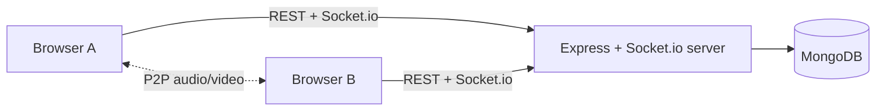

# JoinUs

A Zoom-style video meeting web app with custom WebRTC signaling. Create a meeting, share a link, admit guests from a waiting room and talk face to face in your browser.

Built without third-party media SDKs: peer connections use raw WebRTC and signaling runs on a hand-written Socket.io protocol.

**Live app:** [joinus-flame.vercel.app](https://joinus-flame.vercel.app) · **API health:** [joinus-vobk.onrender.com/api/health](https://joinus-vobk.onrender.com/api/health)

> The API runs on a free Render instance that sleeps when idle, so the first request after a pause can take up to a minute.

## Project Name

JoinUs: secure, browser-based video meetings with host-controlled admission.

## Problem Statement

Small teams, classes and study groups need a simple way to meet online without heavyweight platforms. JoinUs provides link-based meetings with host-controlled admission and reliable audio/video, even behind strict NATs.

## Target Users

- **Hosts:** teachers, team leads and organizers who schedule meetings and control who joins.
- **Participants:** anyone joining from a link on a desktop or mobile browser.

## Solution

A Node/Express + Socket.io server owns the business rules and relays signaling messages. A thin React client renders the state. Audio and video flow peer-to-peer (mesh, up to 6 participants) with STUN/TURN for NAT traversal.

The server is API-first and client-agnostic: authentication uses `Authorization: Bearer` tokens and the signaling layer is a plain JSON event protocol, so a mobile app can reuse the same backend.

## Key Features

Available now:

- Register and log in with JWT authentication
- Instant and scheduled meetings with shareable codes (e.g. `abc-defg-hij`)
- Dashboard with upcoming and past meetings, join by code or link, and one-click invite links
- Responsive, touch-friendly UI

Planned:

- Waiting room with host admit/deny controls
- Multi-party audio and video with mute, camera toggle and screen share
- In-meeting chat and meeting history
- Automatic reconnects, device switching and a connection-quality indicator

## Tech Stack

| Layer | Technology |
| --- | --- |
| Client | React 19, Vite, React Router |
| Server | Node.js, Express, Socket.io |
| Database | MongoDB, Mongoose |
| Realtime media | WebRTC (P2P mesh), STUN + TURN |
| Auth and validation | JWT, bcryptjs, zod |
| Security | helmet, CORS allow-list |
| Testing | Jest, Supertest, mongodb-memory-server |
| Hosting | Vercel (client), Render (server), MongoDB Atlas (database) |

## Architecture



```
joinus/
├── client/              # React + Vite web client
│   └── src/
│       ├── api/         # fetch client that attaches the bearer token
│       ├── components/  # shared UI pieces
│       ├── context/     # AuthContext (session restore, login, logout)
│       ├── lib/         # pure helpers (dates, invite links)
│       └── pages/       # route-level screens
├── server/              # Express + Socket.io backend
│   ├── src/
│   │   ├── config/      # env validation, database connection
│   │   ├── controllers/ # request handlers
│   │   ├── middleware/  # auth, validation, error handling
│   │   ├── models/      # Mongoose models
│   │   ├── routes/      # route definitions
│   │   ├── schemas/     # zod request schemas
│   │   ├── sockets/     # Socket.io wiring, event handlers, room registry
│   │   └── utils/       # tokens, meeting codes, errors
│   └── tests/           # Jest + Supertest suites
└── README.md
```

### Signaling protocol

Realtime signaling runs on Socket.io, on the same origin as the REST API. The protocol is plain JSON events, so any client (web or mobile) can implement it.

**Connecting.** Pass the same JWT used for REST in the handshake: `io(API_URL, { auth: { token } })`. A refused connection fires `connect_error` with `err.data = { code, message }`, where `code` is `UNAUTHORIZED`, `INVALID_TOKEN` or `TOKEN_EXPIRED`.

**Identity.** The peer id is the `socket.id`. The user id and display name always come from the verified token, never from an event payload.

**Acknowledgements.** Every client-to-server event takes an ack callback that receives `{ ok: true, ...data }` or `{ ok: false, error: { code, message } }`.

Client to server:

| Event | Payload | Ack data | Error codes |
| --- | --- | --- | --- |
| `room:join` | `{ code }` | `{ peerId, peers: [{ peerId, user: { id, name } }] }` | `VALIDATION_ERROR`, `MEETING_NOT_FOUND`, `MEETING_CANCELLED`, `ROOM_FULL`, `ALREADY_IN_ROOM` |
| `room:leave` | none | `{}` | none (safe to call twice) |
| `signal` | `{ to, description?, candidate? }` | `{}` | `VALIDATION_ERROR`, `NOT_IN_ROOM`, `PEER_NOT_FOUND` |

Server to client:

| Event | Payload | Meaning |
| --- | --- | --- |
| `room:peer-joined` | `{ peerId, user: { id, name } }` | Someone joined your room |
| `room:peer-left` | `{ peerId }` | Someone left, disconnected or was replaced by a newer session |
| `room:kicked` | `{ reason }` | You were removed from the room. `reason` is `JOINED_ELSEWHERE` |
| `signal` | `{ from, description?, candidate? }` | A relayed WebRTC message from a peer in your room |

**Rules**

- A meeting is joinable only if it exists and is active. Unknown codes return `MEETING_NOT_FOUND` and cancelled meetings return `MEETING_CANCELLED`.
- A room holds at most 2 peers for now. Another join returns `ROOM_FULL`.
- If the same user joins again (refresh or a second tab), the newer session wins: the older socket receives `room:kicked`, and the other peers see `room:peer-left` followed by `room:peer-joined`.
- `signal` carries exactly one of `description` (`{ type, sdp }`, where a `rollback` has no `sdp`) or `candidate` (`{ candidate, sdpMid, sdpMLineIndex, usernameFragment }`). The end-of-candidates `null` is not sent.
- `signal` is relayed only between two different peers in the same room. A target in another room or an unknown id returns `PEER_NOT_FOUND`. The `from` field is set by the server, and unlisted payload fields are dropped.
- Disconnecting removes the peer from its room and notifies the others.
- Messages are limited to 100 KB.

## API Reference

All errors share one shape: `{ "error": { "code": "...", "message": "...", "details": [...] } }`.

| Method | Endpoint | Auth | Description |
| --- | --- | --- | --- |
| GET | `/api/health` | none | Service health |
| POST | `/api/auth/register` | none | Create an account, returns `user` and `token` |
| POST | `/api/auth/login` | none | Log in, returns `user` and `token` |
| GET | `/api/auth/me` | Bearer | Current user |
| POST | `/api/meetings` | Bearer | Create an instant or scheduled meeting |
| GET | `/api/meetings?filter=upcoming\|past\|all` | Bearer | List your meetings |
| GET | `/api/meetings/:code` | none | Minimal public info for an invite page |
| PATCH | `/api/meetings/:code` | Host | Edit title or scheduled time |
| DELETE | `/api/meetings/:code` | Host | Cancel the meeting |

## Local Setup

Requires Node.js 20+ and MongoDB (local or Atlas).

```bash
git clone <your-repo-url> joinus
cd joinus

# Server
cd server
cp .env.example .env     # then fill in the values
npm install
npm run dev              # http://localhost:5000

# Client (new terminal)
cd client
cp .env.example .env
npm install
npm run dev              # http://localhost:5173
```

Generate a strong `JWT_SECRET` with:

```bash
node -e "console.log(require('crypto').randomBytes(48).toString('hex'))"
```

## Testing

```bash
cd server
npm test
```

The suites run the real Express app against an in-memory MongoDB, so they never touch your database. The first run downloads a MongoDB binary and takes a little longer.

## Environment Variables

**`server/.env`**

| Variable | Description |
| --- | --- |
| `NODE_ENV` | `development`, `test` or `production` |
| `PORT` | API port (set automatically on Render) |
| `MONGODB_URI` | MongoDB connection string |
| `JWT_SECRET` | Secret for signing JWTs, at least 32 characters |
| `JWT_EXPIRES_IN` | Token lifetime, e.g. `7d` |
| `CLIENT_ORIGIN` | Allowed CORS origin(s), comma-separated, no paths |

**`client/.env`**

| Variable | Description |
| --- | --- |
| `VITE_API_URL` | Base URL of the API server |

The server validates its environment at startup and exits with a clear message if anything is missing or malformed.

## Deployment

| Component | Platform | URL |
| --- | --- | --- |
| Client | Vercel | https://joinus-flame.vercel.app |
| Server | Render | https://joinus-vobk.onrender.com |
| Database | MongoDB Atlas | private |

1. **MongoDB Atlas:** create an M0 cluster and a database user. Under Network Access allow `0.0.0.0/0` (Render's outbound IPs change). Copy the `mongodb+srv://` connection string and add `/joinus` as the database name.
2. **Render (server):** create a Web Service from this repository with root directory `server`, build command `npm install` and start command `npm start`. Set the health check path to `/api/health`. Add `NODE_ENV=production`, `MONGODB_URI`, `JWT_SECRET` (a new random value), `JWT_EXPIRES_IN` and `CLIENT_ORIGIN`.
3. **Vercel (client):** import the repository with root directory `client` (Vite preset). Set `VITE_API_URL` to the Render URL. `client/vercel.json` rewrites all routes to `index.html` so invite links like `/m/abc-defg-hij` work on refresh.
4. Set `CLIENT_ORIGIN` on Render to the Vercel URL so CORS allows the client.

Both platforms provide HTTPS, which browsers require for camera and microphone access.
